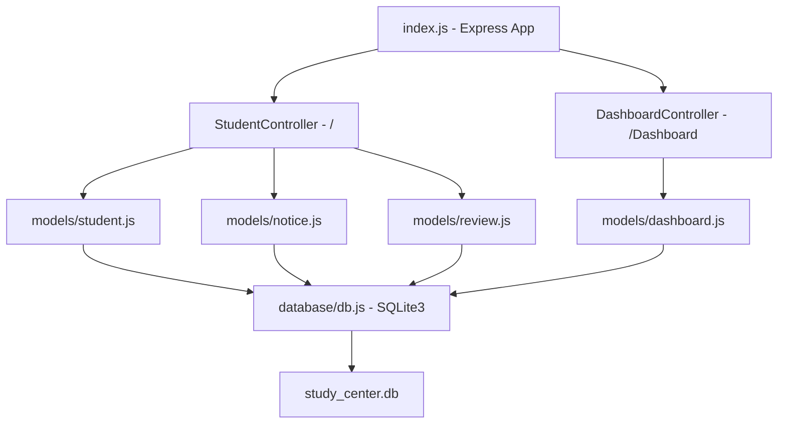

# System Patterns — Pal Study Center (Backend)

## Application Architecture



## Directory Structure

| Path | Purpose |
|---|---|
| [`index.js`](../index.js) | Express app entry point — middleware, route mounting, server start |
| [`controllers/student.js`](../controllers/student.js) | All student, notice, and review routes |
| [`controllers/dashboard.js`](../controllers/dashboard.js) | Dashboard access request routes |
| [`database/db.js`](../database/db.js) | SQLite3 connection + schema initialization |
| [`database/models/student.js`](../database/models/student.js) | Student CRUD, subjects, fees model functions |
| [`database/models/dashboard.js`](../database/models/dashboard.js) | Dashboard record model functions |
| [`database/models/notice.js`](../database/models/notice.js) | Notice CRUD model functions |
| [`database/models/review.js`](../database/models/review.js) | Review CRUD model functions |
| [`database/study_center.db`](../database/study_center.db) | SQLite3 database file |

## Database Schema

### `students` table
| Column | Type | Notes |
|---|---|---|
| `id` | INTEGER PK AUTOINCREMENT | |
| `name` | TEXT NOT NULL | |
| `phone` | TEXT UNIQUE NOT NULL | Primary login identifier |
| `password` | TEXT NOT NULL | bcrypt hashed |
| `class` | TEXT NOT NULL | e.g. `'Class 11th'` |
| `board` | TEXT | e.g. `'MP Board (Hindi Medium)'`, `'CBSE'` |
| `usertype` | TEXT DEFAULT `'student'` | `'student'` or `'admin'` |
| `profile_link` | TEXT | URL of student profile photo |
| `disable_profile` | INTEGER DEFAULT 0 | `0` = active, `1` = disabled |
| `created_at` | DATETIME | Auto set |

### `student_subjects` table
| Column | Type | Notes |
|---|---|---|
| `id` | INTEGER PK AUTOINCREMENT | |
| `student_id` | INTEGER FK → students.id | CASCADE DELETE |
| `subject` | TEXT NOT NULL | e.g. `'Physics'`, `'Mathematics'` |
| `enabled` | INTEGER DEFAULT 1 | `1` = enabled, `0` = disabled |
| `created_at` | DATETIME | |
| UNIQUE | `(student_id, subject)` | |

### `student_fees` table
| Column | Type | Notes |
|---|---|---|
| `id` | INTEGER PK AUTOINCREMENT | |
| `student_id` | INTEGER FK → students.id | CASCADE DELETE |
| `month` | TEXT NOT NULL | `'January'` … `'December'` |
| `status` | TEXT DEFAULT `'Unpaid'` | `'Paid'`, `'Unpaid'`, `'Not applicable'` |
| `created_at` / `updated_at` | DATETIME | |
| UNIQUE | `(student_id, month)` | |

### `notices` table
| Column | Type | Notes |
|---|---|---|
| `id` | INTEGER PK AUTOINCREMENT | |
| `message` | TEXT NOT NULL | Notice content |
| `board` | TEXT | Optional target board |
| `class` | TEXT | Optional target class |
| `created_at` | DATETIME | |

**Filtering logic**: Notice is visible to a student if `board` is NULL/empty OR matches student's board, AND `class` is NULL/empty OR matches student's class.

### `reviews` table
| Column | Type | Notes |
|---|---|---|
| `id` | INTEGER PK AUTOINCREMENT | |
| `student_name` | TEXT NOT NULL | |
| `class` | TEXT NOT NULL | |
| `board` | TEXT NOT NULL | |
| `review_text` | TEXT NOT NULL | |
| `rating` | INTEGER NOT NULL | 1–5 |
| `approved` | INTEGER DEFAULT 0 | `0` = pending, `1` = approved |
| `created_at` | DATETIME | |

### `dashboard` table
| Column | Type | Notes |
|---|---|---|
| `id` | INTEGER PK AUTOINCREMENT | |
| `name` | TEXT NOT NULL | Student's name |
| `email` | TEXT NOT NULL | Student's email |
| `class` | TEXT NOT NULL | |
| `permission` | INTEGER DEFAULT 0 | `0` = pending, `1` = granted |
| `created_at` | DATETIME | |

## API Route Map

### Student Routes (mounted at `/`)
| Method | Path | Description |
|---|---|---|
| `GET` | `/students` | Get all students |
| `POST` | `/createStudent` | Create student + subjects + fees |
| `POST` | `/StudentLogin` | Login with phone + password |
| `PUT` | `/forgotpassword` | Reset password by phone |
| `PATCH` | `/UpdateProfileLink` | Update student profile photo URL |
| `PATCH` | `/DisableProfile` | Toggle student profile disabled state |
| `DELETE` | `/DeleteStudent` | Delete student by id (body) |
| `GET` | `/students/:id/notices` | Get notices for a student (filtered) |
| `GET` | `/notices` | Get all notices (admin) |
| `POST` | `/notices` | Create a notice |
| `DELETE` | `/notices/:id` | Delete a notice |
| `GET` | `/students/:id/subjects` | Get subject access for a student |
| `PATCH` | `/students/:id/subjects` | Update subject access for a student |
| `GET` | `/students/:id/fees` | Get fee records for a student |
| `PATCH` | `/students/:id/fees` | Update fee status for a student |
| `GET` | `/reviews` | Get all reviews (optional `?approved=1`) |
| `GET` | `/reviews/:id` | Get single review |
| `POST` | `/reviews` | Create a review |
| `PATCH` | `/reviews/:id` | Update review (incl. approve) |
| `DELETE` | `/reviews/:id` | Delete a review |

### Dashboard Routes (mounted at `/Dashboard`)
| Method | Path | Description |
|---|---|---|
| `GET` | `/Dashboard/Data` | Get all dashboard records |
| `POST` | `/Dashboard/createDashboard` | Submit dashboard access request |

### Utility Routes (mounted at `/`)
| Method | Path | Description |
|---|---|---|
| `GET` | `/download-db` | Download SQLite DB file (token protected) |

## Code Patterns

### Promise Wrapper Pattern
All three model files use the same three promise wrappers over SQLite3 callbacks:
```js
const dbGet = (sql, params = []) => new Promise((resolve, reject) => { ... });
const dbAll = (sql, params = []) => new Promise((resolve, reject) => { ... });
const dbRun = (sql, params = []) => new Promise((resolve, reject) => { ... });
```
This allows all model functions to be `async/await` throughout.

### Controller Pattern
Each controller is an Express `Router` that imports model modules, applies `express-validator` checks, then calls model functions in `async/await` try/catch blocks. All responses follow the same shape:
```js
{ status: true/false, msg: '...', res: <data> }  // success
{ status: false, msg: '...', err: <error message> }  // failure
```

### Upsert Pattern (Subjects & Fees)
Both subject access and fee status updates use SQLite `INSERT ... ON CONFLICT ... DO UPDATE` for atomic upsert:
```sql
INSERT INTO student_subjects (student_id, subject, enabled)
VALUES (?, ?, ?)
ON CONFLICT(student_id, subject) DO UPDATE SET enabled = excluded.enabled
```

### Schema Auto-Migration
[`db.js`](../database/db.js) checks for the `approved` column in `reviews` at startup and adds it if missing — a simple runtime migration guard.